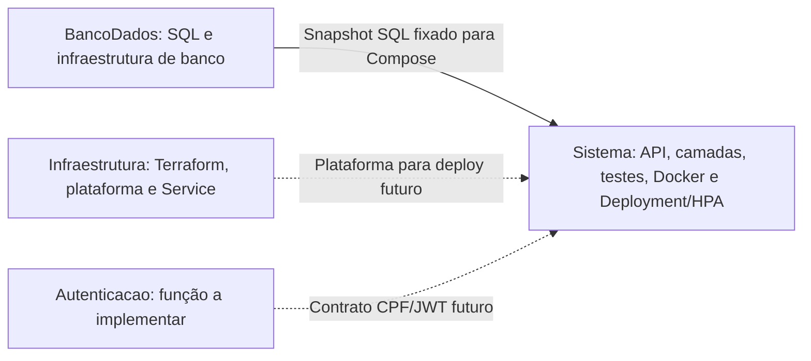

# 🔧 Sistema de Gerenciamento de Mecânica

API para gerenciamento de usuários, clientes, veículos, estoque, catálogo de serviços e ordens de serviço de uma oficina mecânica.

A base funcional da Fase 2 está sendo reorganizada para a Fase 3. A aplicação mantém API, camadas, testes, Dockerfile, Compose e Deployment/HPA. Infraestrutura e banco foram separados em repositórios próprios; a função de autenticação será implementada na E3.

Consulte o [plano vivo](PLANO_FASE_3.md) e a [arquitetura alvo](docs/arquitetura/README.md). A separação E1.2 não provisiona Aurora/Gateway nem altera permissões de negócio. Durante a transição, a pipeline da aplicação executa CI (testes/cobertura/Sonar); publicação de imagem e deploy ficam para as tarefas seguintes.

## Base funcional da Fase 2

- Manter o código organizado em camadas com responsabilidades bem definidas.
- Disponibilizar os fluxos de abertura, consulta, aprovação, execução e entrega de ordens de serviço.
- Notificar o cliente por e-mail nas principais alterações de status da OS.
- Executar build e testes automatizados de forma contínua.
- Empacotar a aplicação com Docker.
- Executar a API e o PostgreSQL em Kubernetes.
- Escalar a API horizontalmente conforme o consumo de CPU e memória.
- Provisionar a infraestrutura do cluster EKS com Terraform.
- Automatizar a publicação da imagem e a aplicação dos manifestos no cluster.

## Funcionalidades

- Autenticação com JWT.
- Cadastro e consulta de usuários.
- Cadastro, consulta, alteração e exclusão de clientes.
- Cadastro, consulta, alteração e exclusão de veículos.
- Gerenciamento do catálogo de serviços.
- Gerenciamento de materiais e estoque.
- Abertura de ordem de serviço com dados do cliente, veículo, serviços e materiais.
- Consulta do status atual de uma ordem de serviço.
- Listagem operacional priorizada por status e antiguidade.
- Diagnóstico, orçamento, aprovação, execução, finalização e entrega da OS.
- Envio de notificações de atualização de status por e-mail.
- Health checks de inicialização, prontidão e disponibilidade.

As rotas completas e exemplos de requisição estão disponíveis nas [collections do Postman](postman/collections).

## Organização dos repositórios na Fase 3



- [GerenciamentoMecanicaInfraestrutura](https://github.com/pknfelps/GerenciamentoMecanicaInfraestrutura)
- [GerenciamentoMecanicaBancoDados](https://github.com/pknfelps/GerenciamentoMecanicaBancoDados)
- [GerenciamentoMecanicaAutenticacao](https://github.com/pknfelps/GerenciamentoMecanicaAutenticacao)

O código distribuído ficará nas branches/PRs da E1.2 até integração. Os diagramas de execução alvo estão no [índice de arquitetura](docs/arquitetura/README.md); não representam recursos já implantados.

### Organização do código

| Projeto | Responsabilidade |
|---|---|
| `GerenciamentoMecanicaSistema` | API HTTP, controllers, autenticação e middleware. |
| `Domain` e `Domain.Interface` | Entidades, objetos de valor, regras e contratos do domínio. |
| `Service` e `Service.Interface` | Casos de uso, regras de aplicação, eventos, contratos de entrada e portas de saída para persistência, autenticação e envio de e-mail. |
| `Infrastructure` | Adaptadores externos: PostgreSQL, health check do banco, geração de JWT, hash de senha e envio de e-mails. |
| `DependencyInjection` | Composition root para registro separado de aplicação, infraestrutura e persistência. |
| `deploy` | Deployment/HPA da aplicação e snapshot SQL para execução local; Terraform/plataforma pertencem ao repositório de infraestrutura. |
| `ControllerTests`, `DomainTests`, `InfrastructureTests` e `ServiceTests` | Testes automatizados por camada. |

Os contratos dos casos de uso e as portas de saída para repositórios, transação, autenticação e e-mail ficam em `Service.Interface`. `Service` implementa os casos de uso contra essas abstrações, enquanto `Infrastructure` fornece os adapters concretos, incluindo as implementações PostgreSQL de `Infrastructure/Persistence/PostgreSql`. O projeto `DependencyInjection` atua como composition root e conecta os adapters aos contratos sem expor detalhes de infraestrutura aos casos de uso.

No cadastro de usuários, `Password` valida a senha em texto puro antes da geração do hash. `UserCredentials`, abstraído por `IUserCredentials`, transporta somente o usuário e a string do hash nos fluxos de persistência e autenticação. Consultas comuns retornam `IUser` sem senha ou hash.

## 🛠️ Tecnologias

- .NET 10 e ASP.NET Core 10.
- PostgreSQL 16.
- Docker e Docker Compose.
- Kubernetes e Kustomize.
- Horizontal Pod Autoscaler e Metrics Server.
- Amazon Web Services: VPC, IAM, EC2 e EKS.
- Terraform 1.15.
- GitHub Actions.
- Docker Hub.
- SonarCloud.
- Postman.
- smtp4dev para captura local dos e-mails.

## Build e testes sem Docker

### Pré-requisitos

- .NET SDK 10.
- PostgreSQL acessível para os testes que dependem de persistência.

Na raiz do repositório:

```bash
dotnet restore GerenciamentoMecanicaSistema.slnx
dotnet build GerenciamentoMecanicaSistema.slnx --no-restore
dotnet test GerenciamentoMecanicaSistema.slnx --no-build --no-restore
```

## ▶️ Execução local com Docker Compose

### ✅ Pré-requisitos

- Docker Desktop com Docker Compose v2.
- Portas `8080`, `5432`, `3000` e `2525` disponíveis, ou alteradas no arquivo `.env`.

### Configuração

Crie o arquivo local de variáveis a partir do exemplo:

```bash
cp .env.example .env
```

No PowerShell:

```powershell
Copy-Item .env.example .env
```

Revise principalmente `POSTGRES_PASSWORD` e `JWT_KEY`. O arquivo `.env` é ignorado pelo Git e não deve ser enviado ao repositório.

### 🚀 Inicialização

Construa a imagem e suba o ambiente:

```bash
docker compose up --build -d
```

O Compose inicia:

- API .NET;
- PostgreSQL;
- smtp4dev.

A API só é iniciada depois que o PostgreSQL passa no health check. Na primeira criação do volume do banco, o script [Init.sql](deploy/local/database/Init.sql) cria as tabelas e os dados iniciais. A [origem e verificação do snapshot](deploy/local/database/README.md) permitem usar o Compose sem clonar outro repositório.

O usuário inicial agora é armazenado com hash PBKDF2. Ambientes criados antes dessa alteração ainda possuem a senha em texto puro no volume existente; para desenvolvimento, recrie o volume com `docker compose down --volumes` antes de subir o ambiente novamente.

Verifique o estado dos serviços:

```bash
docker compose ps
```

Consulte os logs da API:

```bash
docker compose logs -f api
```

### 🌐 Endereços locais

| Serviço | Endereço padrão |
|---|---|
| API | `http://localhost:8080` |
| Swagger UI | `http://localhost:8080/swagger` |
| Health check | `http://localhost:8080/health/ready` |
| PostgreSQL | `localhost:5432` |
| Painel do smtp4dev | `http://localhost:3000` |
| SMTP | `localhost:2525` |

As portas podem ser alteradas no `.env` sem modificar o Compose.

### Encerramento

Para parar os containers preservando os dados:

```bash
docker compose down
```

Para recriar completamente o banco e o armazenamento do smtp4dev:

```bash
docker compose down --volumes
docker compose up --build -d
```

O uso de `--volumes` remove permanentemente os dados locais dos volumes do projeto.

## 🔑 Dados iniciais

O script de inicialização registra um usuário administrativo:

| Campo | Valor |
|---|---|
| Nome | `Admin` |
| Senha | `Admin@123` |
| Perfil | `Admin` |

Também são criados cliente, veículo, serviço e material para testes das APIs. Essas credenciais são destinadas somente aos ambientes de estudo e desenvolvimento.

## Health checks

| Rota | Finalidade |
|---|---|
| `/health/startup` | Confirma que a inicialização da API foi concluída. |
| `/health/ready` | Verifica se a API está pronta para receber requisições e acessar o banco. |
| `/health/live` | Verifica se o processo da API está ativo. |

Os manifestos Kubernetes usam essas rotas nas probes de startup, readiness e liveness.

## 🧪 Postman

Os arquivos estão organizados em:

- [Collections](postman/collections): autenticação, catálogo, clientes, ordens, estoque, usuários e veículos.
- [Ambiente de desenvolvimento](postman/environments/Dev.environment.yaml).

Importe o ambiente e as collections no Postman. A variável `base_url` utiliza `http://localhost:8080` por padrão. Na Fase 3, o endereço de nuvem será o API Gateway após sua implantação; essa entrada ainda não foi publicada.

Após autenticar, armazene o JWT na variável `token` do ambiente.

## 📧 Notificações por e-mail

No ambiente local, as notificações de orçamento e atualização de status são enviadas para o smtp4dev. Elas não saem do ambiente e podem ser visualizadas em `http://localhost:3000`.

Em outros ambientes, configure `EmailSettings__Host`, `EmailSettings__Port`, credenciais, remetente e uso de TLS de acordo com o servidor SMTP escolhido.

## Infraestrutura e banco separados

O Terraform existente foi transferido para `terraform/` em [GerenciamentoMecanicaInfraestrutura](https://github.com/pknfelps/GerenciamentoMecanicaInfraestrutura). A base ainda reflete a Fase 2; rede privada, Aurora, Gateway, ECR, estados remotos e ambientes serão implementados nas tarefas próprias.

O esquema/seeds pertence a `sql/Init.sql` em [GerenciamentoMecanicaBancoDados](https://github.com/pknfelps/GerenciamentoMecanicaBancoDados). A aplicação mantém um snapshot com commit e hash em `deploy/local/database/`; veja suas [instruções](deploy/local/database/README.md). Os manifestos antigos de PostgreSQL/armazenamento no EKS estão arquivados em `legacy/kubernetes/` no repositório de banco.

## Manifestos da aplicação

[deploy/kubernetes](deploy/kubernetes) contém somente Deployment e HPA, com probes e recursos preservados. Service/NLB e Metrics Server pertencem à infraestrutura. Não aplicar o manifesto opcional de Metrics Server quando o add-on já estiver instalado.

Verifique a composição sem acessar um cluster:

```powershell
kubectl kustomize deploy/kubernetes
```

O Deployment continua referenciando `db-secrets`, com `CONNECTION_STRING` e `JWT_KEY`; o [arquivo de exemplo](deploy/kubernetes/db-secrets.example.yaml) contém apenas placeholders. Antes de qualquer deploy, banco, Secret, namespace, plataforma e imagem devem estar preparados. A imagem herdada do Docker Hub será substituída por ECR na implementação da entrega. Não há deploy automático durante esta separação.

## CI/CD durante a separação

A [pipeline](.github/workflows/pipeline.yml) executa em pushes para main/develop, PRs destinados a essas branches e acionamento manual. Ela verifica o snapshot SQL, executa restore/build/testes com cobertura e análise SonarCloud. `SONAR_TOKEN` permanece necessário para a análise.

Os jobs antigos de publicação no Docker Hub, uso de chaves AWS e deploy do PostgreSQL no EKS foram retirados deste fluxo. E1.5–E1.7/E2/E3 implementarão a entrega por ambiente com ECR/OIDC/Aurora; até lá, execução manual da pipeline também não publica nem implanta recursos.

## Evidências e entrega

- Repositório: [github.com/pknfelps/GerenciamentoMecanicaSistema](https://github.com/pknfelps/GerenciamentoMecanicaSistema).
- Collections: [postman/collections](postman/collections).
- Pipeline: [GitHub Actions](https://github.com/pknfelps/GerenciamentoMecanicaSistema/actions).
- Vídeo demonstrativo: adicionar o link após a gravação.

A evidência final da Fase 3 seguirá a E7 do plano, com autenticação serverless, entrega por ambiente e observabilidade; a demonstração ainda não foi realizada.
