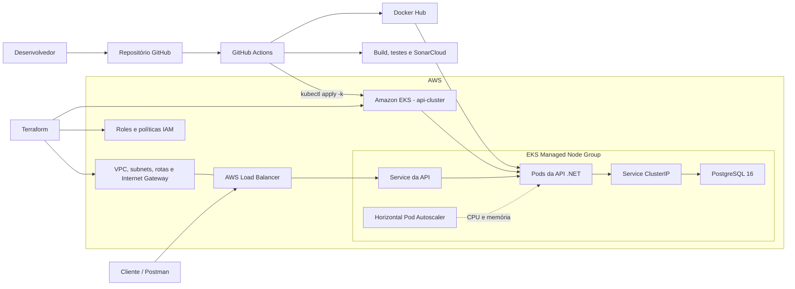

# 🔧 Sistema de Gerenciamento de Mecânica

API para gerenciamento de usuários, clientes, veículos, estoque, catálogo de serviços e ordens de serviço de uma oficina mecânica.

O projeto evolui a solução da Fase 1 com novos fluxos de ordem de serviço, notificações por e-mail, testes automatizados, conteinerização, orquestração com Kubernetes, infraestrutura AWS provisionada com Terraform e entrega contínua pelo GitHub Actions.

## Objetivos da Fase 2

- Manter o código organizado em camadas com responsabilidades bem definidas.
- Disponibilizar os fluxos de abertura, consulta, aprovação, execução e entrega de ordens de serviço.
- Notificar o cliente por e-mail nas principais alterações de status da OS.
- Executar build e testes automatizados de forma contínua.
- Empacotar a aplicação com Docker.
- Executar a API e o PostgreSQL em Kubernetes.
- Escalar a API horizontalmente conforme o consumo de CPU e memória.
- Provisionar a infraestrutura do cluster EKS com Terraform.
- Automatizar a publicação da imagem e a aplicação dos manifestos no cluster.

## Funcionalidades

- Autenticação com JWT.
- Cadastro e consulta de usuários.
- Cadastro, consulta, alteração e exclusão de clientes.
- Cadastro, consulta, alteração e exclusão de veículos.
- Gerenciamento do catálogo de serviços.
- Gerenciamento de materiais e estoque.
- Abertura de ordem de serviço com dados do cliente, veículo, serviços e materiais.
- Consulta do status atual de uma ordem de serviço.
- Listagem operacional priorizada por status e antiguidade.
- Diagnóstico, orçamento, aprovação, execução, finalização e entrega da OS.
- Envio de notificações de atualização de status por e-mail.
- Health checks de inicialização, prontidão e disponibilidade.

As rotas completas e exemplos de requisição estão disponíveis nas [collections do Postman](postman/collections).

## Arquitetura da solução



### Organização do código

| Projeto | Responsabilidade |
|---|---|
| `GerenciamentoMecanicaSistema` | API HTTP, controllers, autenticação e middleware. |
| `Domain` e `Domain.Interface` | Entidades, objetos de valor, regras e contratos do domínio. |
| `Service` e `Service.Interface` | Casos de uso, regras de aplicação, eventos e contratos dos casos de uso. |
| `Infrastructure.Interface` | Contratos implementados pela infraestrutura: persistência, autenticação e envio de e-mail. |
| `Infrastructure` | Adaptadores externos: PostgreSQL, health check do banco, geração de JWT, hash de senha e envio de e-mails. |
| `Bootstrapper` | Composition root para registro separado de aplicação, infraestrutura e persistência. |
| `deploy` | Artefatos operacionais de Kubernetes e Terraform, fora da infraestrutura executada pela API. |
| `ControllerTests`, `DomainTests`, `InfrastructureTests` e `ServiceTests` | Testes automatizados por camada. |

As interfaces de repositório e transação ficam em `Infrastructure.Interface/Persistence`. As implementações PostgreSQL ficam em `Infrastructure/Persistence/PostgreSql`. Dessa forma, `Service` e `Infrastructure` compartilham apenas as abstrações de `Infrastructure.Interface`, sem que os casos de uso conheçam classes concretas.

No cadastro de usuários, `Password` valida a senha em texto puro antes da geração do hash. `UserCredentials`, abstraído por `IUserCredentials`, transporta somente o usuário e a string do hash nos fluxos de persistência e autenticação. Consultas comuns retornam `IUser` sem senha ou hash.

## 🛠️ Tecnologias

- .NET 10 e ASP.NET Core 10.
- PostgreSQL 16.
- Docker e Docker Compose.
- Kubernetes e Kustomize.
- Horizontal Pod Autoscaler e Metrics Server.
- Amazon Web Services: VPC, IAM, EC2 e EKS.
- Terraform 1.15.
- GitHub Actions.
- Docker Hub.
- SonarCloud.
- Postman.
- smtp4dev para captura local dos e-mails.

## Build e testes sem Docker

### Pré-requisitos

- .NET SDK 10.
- PostgreSQL acessível para os testes que dependem de persistência.

Na raiz do repositório:

```bash
dotnet restore GerenciamentoMecanicaSistema.slnx
dotnet build GerenciamentoMecanicaSistema.slnx --no-restore
dotnet test GerenciamentoMecanicaSistema.slnx --no-build --no-restore
```

## ▶️ Execução local com Docker Compose

### ✅ Pré-requisitos

- Docker Desktop com Docker Compose v2.
- Portas `8080`, `5432`, `3000` e `2525` disponíveis, ou alteradas no arquivo `.env`.

### Configuração

Crie o arquivo local de variáveis a partir do exemplo:

```bash
cp .env.example .env
```

No PowerShell:

```powershell
Copy-Item .env.example .env
```

Revise principalmente `POSTGRES_PASSWORD` e `JWT_KEY`. O arquivo `.env` é ignorado pelo Git e não deve ser enviado ao repositório.

### 🚀 Inicialização

Construa a imagem e suba o ambiente:

```bash
docker compose up --build -d
```

O Compose inicia:

- API .NET;
- PostgreSQL;
- smtp4dev.

A API só é iniciada depois que o PostgreSQL passa no health check. Na primeira criação do volume do banco, o script [Init.sql](InitDb/Init.sql) cria as tabelas e os dados iniciais.

O usuário inicial agora é armazenado com hash PBKDF2. Ambientes criados antes dessa alteração ainda possuem a senha em texto puro no volume existente; para desenvolvimento, recrie o volume com `docker compose down --volumes` antes de subir o ambiente novamente.

Verifique o estado dos serviços:

```bash
docker compose ps
```

Consulte os logs da API:

```bash
docker compose logs -f api
```

### 🌐 Endereços locais

| Serviço | Endereço padrão |
|---|---|
| API | `http://localhost:8080` |
| Swagger UI | `http://localhost:8080/swagger` |
| Health check | `http://localhost:8080/health/ready` |
| PostgreSQL | `localhost:5432` |
| Painel do smtp4dev | `http://localhost:3000` |
| SMTP | `localhost:2525` |

As portas podem ser alteradas no `.env` sem modificar o Compose.

### Encerramento

Para parar os containers preservando os dados:

```bash
docker compose down
```

Para recriar completamente o banco e o armazenamento do smtp4dev:

```bash
docker compose down --volumes
docker compose up --build -d
```

O uso de `--volumes` remove permanentemente os dados locais dos volumes do projeto.

## 🔑 Dados iniciais

O script de inicialização registra um usuário administrativo:

| Campo | Valor |
|---|---|
| Nome | `Admin` |
| Senha | `Admin@123` |
| Perfil | `Admin` |

Também são criados cliente, veículo, serviço e material para testes das APIs. Essas credenciais são destinadas somente aos ambientes de estudo e desenvolvimento.

## Health checks

| Rota | Finalidade |
|---|---|
| `/health/startup` | Confirma que a inicialização da API foi concluída. |
| `/health/ready` | Verifica se a API está pronta para receber requisições e acessar o banco. |
| `/health/live` | Verifica se o processo da API está ativo. |

Os manifestos Kubernetes usam essas rotas nas probes de startup, readiness e liveness.

## 🧪 Postman

Os arquivos estão organizados em:

- [Collections](postman/collections): autenticação, catálogo, clientes, ordens, estoque, usuários e veículos.
- [Ambiente de desenvolvimento](postman/environments/Dev.postman_environment.json).

Importe o ambiente e as collections no Postman. A variável `base_url` utiliza `http://localhost:8080` por padrão. Para consumir a aplicação no EKS, altere essa variável para o endereço externo do Load Balancer.

Após autenticar, armazene o JWT na variável `token` do ambiente.

## 📧 Notificações por e-mail

No ambiente local, as notificações de orçamento e atualização de status são enviadas para o smtp4dev. Elas não saem do ambiente e podem ser visualizadas em `http://localhost:3000`.

Em outros ambientes, configure `EmailSettings__Host`, `EmailSettings__Port`, credenciais, remetente e uso de TLS de acordo com o servidor SMTP escolhido.

## Infraestrutura como código com Terraform

Os arquivos estão em [deploy/terraform](deploy/terraform).

### Recursos provisionados

- VPC com suporte a DNS.
- Duas subnets públicas em zonas de disponibilidade distintas.
- Internet Gateway.
- Tabela de rotas pública e associações com as subnets.
- Role IAM do control plane com `AmazonEKSClusterPolicy`.
- Role IAM dos nós com:
  - `AmazonEKSWorkerNodePolicy`;
  - `AmazonEC2ContainerRegistryPullOnly`;
  - `AmazonEKS_CNI_Policy`.
- Cluster Amazon EKS.
- EKS Managed Node Group com capacidade e escalabilidade configuráveis.

O PostgreSQL não é provisionado como serviço gerenciado pelo Terraform. Ele é implantado dentro do cluster pelos manifestos Kubernetes.

### Pré-requisitos

- Terraform `1.15.x` disponível no `PATH`.
- AWS CLI configurada.
- Identidade AWS autorizada a gerenciar VPC, EC2, IAM e EKS, incluindo `eks:DescribeCluster` e `iam:PassRole`.

Confirme a identidade utilizada:

```bash
aws sts get-caller-identity
```

### Variáveis

Entre na pasta do Terraform e copie o exemplo:

```bash
cd deploy/terraform
cp terraform.tfvars.example terraform.tfvars
```

No PowerShell:

```powershell
Set-Location deploy/terraform
Copy-Item terraform.tfvars.example terraform.tfvars
```

Revise principalmente:

- `aws_region`;
- `cluster_name`;
- `kubernetes_version`;
- blocos CIDR da VPC e das subnets;
- tipos e quantidade de nós;
- capacidade `ON_DEMAND` ou `SPOT`.

O arquivo `terraform.tfvars` é local, está ignorado pelo Git e não deve conter credenciais.

### Provisionamento

Inicialize e valide:

```bash
terraform init
terraform fmt -check -recursive
terraform validate
```

Gere e revise um plano:

```bash
terraform plan -out=api-cluster
terraform show api-cluster
```

Aplique exatamente o plano revisado:

```bash
terraform apply api-cluster
```

Ao final, consulte os outputs:

```bash
terraform output
```

O backend atual é local. Preserve o arquivo `terraform.tfstate`, não o envie ao Git e não execute o Terraform simultaneamente em mais de um terminal.

### Configuração do kubeconfig

Com o cluster ativo:

```bash
aws eks update-kubeconfig --region us-east-1 --name api-cluster
kubectl get nodes
```

Se `aws_region` ou `cluster_name` forem alterados no `terraform.tfvars`, utilize os mesmos valores no comando e na pipeline.

### Destruição da infraestrutura

Os recursos AWS geram custos enquanto estiverem ativos. Para revisar e remover a infraestrutura gerenciada:

```bash
terraform plan -destroy -out=destroy.tfplan
terraform show destroy.tfplan
terraform apply destroy.tfplan
```

Revise cuidadosamente o plano de destruição antes da aplicação.

## Deploy em Kubernetes

Os manifestos estão em [deploy/kubernetes](deploy/kubernetes). O Kustomize aplica:

- Deployments da API e do PostgreSQL;
- Services `LoadBalancer` e `ClusterIP`;
- Referências a um Secret externo com configurações da aplicação e do banco;
- ConfigMap com o script de inicialização;
- StorageClass de estudo;
- HPA baseado em CPU e memória.

O PVC permanece no projeto como referência de estudo, mas não é aplicado pelo Kustomize nem utilizado pelo Deployment do banco. Dessa forma, os dados do PostgreSQL não são persistidos após a substituição definitiva do pod.

### Configuração

O Secret `db-secrets` não é versionado. Na pipeline ele é criado a partir dos GitHub Secrets. Para uma aplicação manual de estudo, use [db-secrets.example.yaml](deploy/kubernetes/db-secrets.example.yaml) apenas como modelo, gere um arquivo local ignorado pelo Git ou crie o Secret diretamente com `kubectl create secret`.

Se o cluster ainda não possuir o Metrics Server, aplique:

```bash
kubectl apply -f deploy/kubernetes/metrics-server.yaml
```

O Metrics Server é necessário para que o HPA obtenha as métricas de CPU e memória.

### Aplicação dos manifestos

Na raiz do repositório:

```bash
kubectl kustomize deploy/kubernetes
kubectl apply --dry-run=client --validate=false -k deploy/kubernetes
kubectl apply -k deploy/kubernetes
```

Valide os rollouts e os recursos:

```bash
kubectl rollout status deployment/deploy-gerenciamento-db --timeout=180s
kubectl rollout status deployment/deploy-gerenciamento-api --timeout=180s
kubectl get deployments,pods,services,hpa
kubectl top pods
```

Consulte o endereço público da API:

```bash
kubectl get service svc-gerenciamento-api
```

Use o valor de `EXTERNAL-IP` ou hostname como `base_url` no Postman.

## CI/CD

A pipeline está em [.github/workflows/pipeline.yml](.github/workflows/pipeline.yml) e é disparada por `push`.

O fluxo executado é:

1. Checkout do repositório.
2. Restauração, build e testes automatizados com geração de cobertura.
3. Análise de código no SonarCloud.
4. Build da imagem Docker.
5. Publicação da imagem `felipejesusoliveira/gerenciamentomecanicasistema:latest` no Docker Hub.
6. Autenticação na AWS e atualização do kubeconfig do cluster `api-cluster`.
7. Criação ou atualização do Secret Kubernetes a partir dos secrets protegidos do repositório.
8. Aplicação dos manifestos com `kubectl apply -k deploy/kubernetes`.

O Terraform não é executado pela pipeline. O cluster deve ser provisionado manualmente antes do primeiro deploy.

### Secrets do GitHub

| Secret | Uso |
|---|---|
| `SONAR_TOKEN` | Autenticação da análise no SonarCloud. |
| `DOCKER_TOKEN` | Publicação da imagem no Docker Hub. |
| `AWS_ACCESS_KEY_ID` | Identificação da credencial utilizada no deploy. |
| `AWS_ACCESS_KEY_SECRET` | Chave secreta utilizada no deploy. |
| `POSTGRES_DB` | Nome do banco PostgreSQL no cluster. |
| `POSTGRES_USER` | Usuário do PostgreSQL no cluster. |
| `POSTGRES_PASSWORD` | Senha do PostgreSQL no cluster. |
| `JWT_KEY` | Chave privada usada para assinar os tokens JWT. |

A identidade AWS da pipeline precisa consultar o cluster EKS e estar autorizada a acessar a API Kubernetes.

## Evidências e entrega

- Repositório: [github.com/pknfelps/GerenciamentoMecanicaSistema](https://github.com/pknfelps/GerenciamentoMecanicaSistema).
- Collections: [postman/collections](postman/collections).
- Pipeline: [GitHub Actions](https://github.com/pknfelps/GerenciamentoMecanicaSistema/actions).
- Vídeo demonstrativo: adicionar o link após a gravação.

O vídeo deve demonstrar o deploy da aplicação, a execução do CI/CD, o consumo das APIs e a escalabilidade automática do HPA.
