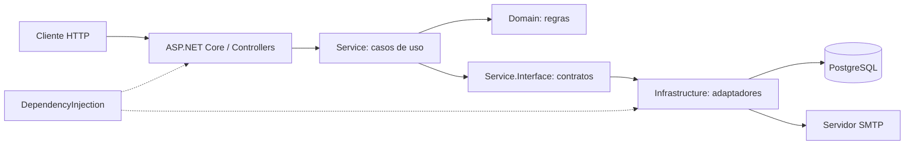

# Sistema de Gerenciamento de Mecânica

API do sistema de oficina: usuários, clientes, veículos, catálogo, estoque e ciclo de ordens de serviço (OS). Mantém as regras de negócio, persistência, autenticação interna, notificações SMTP, testes, imagem Docker e Deployment/HPA.

## Estado da implementação

A separação em quatro repositórios está integrada. A API e os testes existentes são executáveis; a pipeline valida testes/cobertura, SonarCloud e build da imagem. A arquitetura AWS da Fase 3 está documentada, mas sua implantação ainda está pendente.

| Disponível | A implementar |
|---|---|
| API .NET, JWT interno, PostgreSQL, SMTP e health checks | Validação serverless de documentos CPF/CNPJ e permissões Admin/Mechanic/Customer |
| Dockerfile, Compose opcional e Deployment/HPA | Publicação da imagem no ECR e deploy nos ambientes hom/prd |
| CI com testes, cobertura, SonarCloud e build Docker | RDS PostgreSQL, API Gateway e observabilidade OpenTelemetry/New Relic |

O foco de uso será a API na AWS. A URL do Gateway ainda não foi publicada. A [arquitetura alvo](docs/arquitetura/README.md) descreve contratos futuros; as [collections](postman/collections) e o OpenAPI gerado pela API representam as operações atuais.

## Componentes e repositórios

Diagrama da aplicação existente:


```mermaid
flowchart LR
    CLIENT["Cliente HTTP"] --> API["ASP.NET Core / Controllers"]
    API --> SERVICE["Service: casos de uso"]
    SERVICE --> DOMAIN["Domain: regras"]
    SERVICE --> PORTS["Service.Interface: contratos"]
    PORTS --> INFRA["Infrastructure: adaptadores"]
    INFRA --> PG[("PostgreSQL")]
    INFRA --> SMTP["Servidor SMTP"]
    DI["DependencyInjection"] -.-> API
    DI -.-> INFRA
```

| Repositório | Responsabilidade |
|---|---|
| Este repositório | API, camadas, testes, Dockerfile/Compose e Deployment/HPA |
| [Infraestrutura](https://github.com/pknfelps/GerenciamentoMecanicaInfraestrutura/tree/develop) | Terraform, plataforma Kubernetes, Service e futura entrada Gateway/NLB |
| [Banco](https://github.com/pknfelps/GerenciamentoMecanicaBancoDados/tree/develop) | SQL/seeds, infraestrutura RDS PostgreSQL e Job de inicialização planejados |
| [Autenticação](https://github.com/pknfelps/GerenciamentoMecanicaAutenticacao/tree/develop) | Futura Lambda de validação de documentos CPF/CNPJ e emissão de JWT |

Os projetos `Domain.Interface` e `Service.Interface` definem contratos; `Infrastructure` implementa persistência PostgreSQL, JWT, hash de senha e SMTP; `DependencyInjection` registra os componentes. Consultas comuns de usuários não retornam senha/hash; os fluxos de credenciais usam `UserCredentials`.

## Tecnologias e pré-requisitos

- .NET SDK 10 / ASP.NET Core 10.
- PostgreSQL 16 para uso local; acesso por Npgsql/Dapper.
- Docker com engine Linux e Compose v2; smtp4dev para e-mails locais.
- Docker ativo para a suíte completa: os testes de persistência usam Testcontainers e criam seus próprios containers PostgreSQL.
- kubectl com Kustomize para renderizar os manifestos.
- GitHub Actions e SonarCloud no CI.

AWS EKS, RDS PostgreSQL, ECR, API Gateway e Lambda compõem o destino da Fase 3. Terraform da base e entrada pertence ao repositório de infraestrutura; Terraform do banco pertence ao repositório de banco. A escolha RDS `db.t3.micro` Single-AZ substituiu Aurora após a restrição do AWS Free Plan ([ADR 007](docs/arquitetura/adrs/007-RDS-FREE-PLAN.md)); implementação e validação ainda pendentes.

## Build e testes

Na raiz, com .NET 10 e Docker ativo para os testes de persistência:

```bash
dotnet restore GerenciamentoMecanicaSistema.slnx
dotnet build GerenciamentoMecanicaSistema.slnx --no-restore
dotnet test GerenciamentoMecanicaSistema.slnx --no-build --no-restore
```

Restore/build não precisam de um banco em execução. Os testes de persistência preparam suas próprias tabelas e não usam o banco do Compose.

Para validar somente a imagem, sem iniciar a aplicação:

```bash
docker build --file GerenciamentoMecanicaSistema/Dockerfile --tag gerenciamento-mecanica-api:local .
```

## Execução local opcional

1. Copie [.env.example](.env.example) para `.env`:

   ```powershell
   Copy-Item .env.example .env
   ```

   Em Bash, use `cp .env.example .env`. Defina `POSTGRES_PASSWORD` e uma `JWT_KEY` com pelo menos 32 caracteres. O arquivo local é ignorado pelo Git.

2. Inicie as dependências:

   ```bash
   docker compose up -d db smtp
   ```

3. Prepare manualmente o banco vazio seguindo o [README do banco](https://github.com/pknfelps/GerenciamentoMecanicaBancoDados/tree/develop#execução-local-opcional). O SQL fica exclusivamente nesse repositório. O Compose não cria tabelas/seeds e não sincroniza scripts.

4. Inicie a API:

   ```bash
   docker compose up --build -d api
   docker compose ps
   docker compose logs -f api
   ```

A disponibilidade do PostgreSQL não comprova que o esquema foi preparado. A API pode iniciar com banco vazio, mas as operações de negócio dependem das tabelas.

| Serviço | Endereço local padrão |
|---|---|
| API | http://localhost:8080 |
| Swagger UI (Development) | http://localhost:8080/swagger |
| OpenAPI (Development) | http://localhost:8080/openapi/v1.json |
| Readiness | http://localhost:8080/health/ready |
| PostgreSQL | localhost:5432 |
| Painel smtp4dev | http://localhost:3000 |
| SMTP | localhost:2525 |

As portas do host podem ser ajustadas no `.env`. O Compose usa `ASPNETCORE_ENVIRONMENT=Development`; Swagger/OpenAPI não são expostos pelo código atual em outros ambientes.

Para encerrar preservando os dados, use `docker compose down`. Se optar por apagar os dados locais, `docker compose down --volumes` remove os volumes de PostgreSQL e smtp4dev; depois repita os passos 2–4, incluindo a preparação manual do banco.

## Autenticação e uso da API

Após aplicar os seeds, o usuário educacional é `Admin`, senha `Admin@123`, role `Admin`. A senha é armazenada como hash PBKDF2. Esses dados são somente para demonstração.

O login atual é `POST /authentication`:

```json
{
  "name": "Admin",
  "password": "Admin@123",
  "role": "Admin"
}
```

Use o token retornado como `Authorization: Bearer <token>`. Importe as [collections](postman/collections) e o [ambiente Postman](postman/environments/Dev.environment.yaml); configure `base_url` e `token`.

A API cobre usuários, clientes, veículos, catálogo, materiais/estoque e criação, diagnóstico, orçamento, execução e entrega de OS. A futura rota `POST /customers/validate` será atendida pela Lambda. Novas permissões e operações de usuários ainda serão implementadas conforme o [contrato de acesso](docs/arquitetura/ACESSO_E_AUTENTICACAO.md).

## Configuração e saúde

| Configuração | Uso |
|---|---|
| `ConnectionStrings__DefaultConnection` | Conexão PostgreSQL |
| `Jwt__Issuer`, `Jwt__Audience`, `Jwt__Key` | Emissão e validação JWT compatíveis no ambiente |
| `Runtime__Environment` | Ausente: configuração local. `hom` ou `prd`: carregar JWT e conexão RDS pela AWS na inicialização |
| `AWS_REGION` | Região dos clientes AWS quando o carregamento remoto estiver habilitado (`us-east-1` nos ambientes previstos) |
| `EmailSettings__Host`, `EmailSettings__Port` | Servidor SMTP |
| `EmailSettings__Username`, `EmailSettings__Password`, `EmailSettings__UseTls` | Autenticação/TLS do SMTP |
| `EmailSettings__SenderName`, `EmailSettings__SenderEmail` | Identificação do remetente |

O Compose mapeia essas configurações a partir do `.env` e dos serviços locais. E-mails enviados ao smtp4dev ficam no painel local. Para outro destino, configure o servidor SMTP apropriado.

O carregamento inicial AWS está implementado: lê os parâmetros SSM v2 e a versão `AWSCURRENT` dos Secrets JWT e da credencial `mecanica_api`, mantendo os valores em memória. A conexão usa TLS `VerifyFull` com o certificado público RDS incluído no publish. Falha de leitura, configuração inválida ou prazo de 45 segundos excedido impede a inicialização, sem fallback local. Sem `Runtime__Environment`, o fluxo local permanece; campo vazio ou diferente de `hom`/`prd` é inválido. Consulte [inicialização e conexão AWS](docs/INICIALIZACAO_AWS.md). Policy Terraform e ServiceAccount/overlays estão preparados; apply aprovado, publicação e validação real no EKS permanecem pendentes.

| Rota | Finalidade |
|---|---|
| `/health/startup` | Inicialização da API |
| `/health/ready` | Prontidão e acesso ao banco |
| `/health/live` | Processo ativo |

As probes do Deployment usam essas rotas. Não houve alteração de probes na separação dos repositórios.

## Kubernetes, CI e deploy

A [decisão declarativa](docs/arquitetura/adrs/008-INFRAESTRUTURA-DECLARATIVA.md) mantém Terraform para AWS e manifestos próprios Kubernetes. Infra/banco usam provisionamento manual com plan salvo, aprovação e apply; CI e testes de negócio da API permanecem. Service da base é NodePort 30080, ligado ao NLB Terraform.

[deploy/kubernetes/base](deploy/kubernetes/base) contém Deployment e HPA e é o ponto de entrada do Kustomize local. Os overlays hom/prd referenciam essa base e declaram diretamente os ajustes AWS de cada ambiente. Há somente três arquivos kustomization; o Service pertence à infraestrutura. Para conferir a composição sem acessar o cluster:

```bash
kubectl kustomize deploy/kubernetes/base
kubectl kustomize deploy/kubernetes/overlays/hom
kubectl kustomize deploy/kubernetes/overlays/prd
```

A composição local mantém a imagem anterior no Docker Hub e o Secret `db-secrets`, com `CONNECTION_STRING` e `JWT_KEY`; o [exemplo de Secret](deploy/kubernetes/db-secrets.example.yaml) contém placeholders. Os overlays hom/prd retiram essas referências, habilitam a leitura AWS e usam o ServiceAccount `default/gerenciamento-api`, com startup probe de 60 segundos. A imagem ECR `:pending` é provisória e deve ser substituída por digest na publicação antes de aplicar os overlays. Policy de leitura do banco no Terraform da base, publicação/deploy e validação real ainda precisam ser aplicados/executados; a E2.6 permanece aberta.

A [pipeline](.github/workflows/pipeline.yml) executa em PRs e pushes para `develop`/`main`, além de acionamento manual. Os jobs são `unit-tests`, `code-analysis` e `build-image`; a análise usa `SONAR_TOKEN`. O build Docker ocorre após testes/análise e gera tag `sha-<commit>` no runner. Não há push de imagem, artefato de imagem disponível para download ou deploy nesse workflow.

A entrega planejada publicará no ECR e implantará por OIDC, após provisionar dependências. Consulte a [RFC de entrega](docs/arquitetura/rfcs/002-ENTREGA.md) para a ordem entre os quatro repositórios.

## Contratos de integração

A [especificação central](docs/arquitetura/CONTRATOS_ENTRE_REPOSITORIOS.md) define campos, versões, artefatos, secrets e falhas. Este repositório é o produtor do componente lógico **api** e do pacote **GerenciamentoMecanica.Auth.Contracts**. A versão 1.0.0 foi publicada no S3 via OIDC; o sucesso do workflow de consumo na autenticação foi confirmado pelo mantenedor. Publicadores SSM e integrações de deploy ainda serão implementados. Consulte [operação do Auth.Contracts](docs/arquitetura/PACOTE_AUTH_CONTRACTS.md).

| Interface | Responsabilidade da API |
|---|---|
| Produz para implantação | Imagem ECR identificada por digest; o Deployment não usa latest |
| Produz para Gateway | contracts/api/<commit>/openapi.json e seu .sha256, gerados da mesma revisão implantada |
| Produz para a função | Pacote NuGet de versão fixa em packages/GerenciamentoMecanica.Auth.Contracts/<versao>/, com .sha256 |
| Publica em SSM | /mecanica/<ambiente>/api/v2/: configuração administrada pelo Terraform, sem releases/tentativas; smtp-secret-arn quando aplicável |
| Consome da base | Cluster/namespace/Service, ECR, referência JWT, issuer/audience e endpoint OTel quando habilitado |
| Consome do banco | Writer/porta/database/TLS, versão/hash SQL e api-secret-arn |
| Resolve no runtime | Sua credencial de banco, JWT e SMTP autenticado; nunca a credencial administrativa do banco |
| Solicita após deploy | Plano e aprovação do Gateway com versões fixas dos contratos API/função; operações sequenciais pelo mantenedor |

Build/testes e publicação do pacote são independentes de banco/EKS. Publicação e deploy são resultados distintos: dependência ausente deixa a implantação bloqueada, sem sinalizar sucesso nem criar infraestrutura implicitamente. Release pronta exige rollout/readiness aprovados e dependências compatíveis. A API não inicializa SQL nem administra o Service/NLB.

O [workflow manual OIDC](.github/workflows/aws-oidc-check.yml) verifica a role api do Environment selecionado, em develop/hom ou main/prd. Ele não testa permissões de deploy, publicação de artefatos ou consumo de secrets. As variáveis de entrada são AWS_REGION, AWS_ROLE_ARN e ARTIFACTS_BUCKET; os demais identificadores vêm dos contratos publicados.

## Desenvolvimento e ambientes

Crie branches de trabalho a partir da `develop` atualizada e direcione os PRs para `develop`. A promoção `develop -> main` ocorre quando a entrega estiver concluída. `develop` corresponde a **hom** e `main` a **prd** na arquitetura planejada; os ambientes poderão coexistir. Proteções, Environments e autenticação OIDC foram preparados; a integração do deploy automático ainda será implementada.

## Referências

- [Arquitetura, diagramas, RFCs e ADRs](docs/arquitetura/README.md).
- [Contrato de autenticação e permissões](docs/arquitetura/ACESSO_E_AUTENTICACAO.md).
- [GitHub Actions](https://github.com/pknfelps/GerenciamentoMecanicaSistema/actions).
- Demonstração final e vídeo: pendentes.

Os workflows de CI pipeline/auth-contracts validam PRs para develop/main e permitem execução manual; não repetem os checks no push da mesma revisão. Commits novos substituem checks antigos do mesmo PR, preservando nomes dos jobs e isolando publicações manuais.

### Infraestrutura JWT da E2.12

A base implementa Secret JWT por ambiente e publica jwt-secret-arn, jwt-issuer e jwt-audience em /mecanica/<ambiente>/base/v2/. Base JWT hom aplicada e conferida em 08/10: Secret/SSM/Pod Identity, No changes e isolamento IAM simulado. A API já implementa leitura inicial pelo SDK .NET, overlays com ServiceAccount e policy Terraform para leitura do banco. Apply dessa policy, publicação/deploy, validação no EKS, Lambda e prd permanecem pendentes. A role e a associação Pod Identity para default/gerenciamento-api são administradas pela base. A chave AWSCURRENT fica em memória, sem fallback local ou cópia para Secret Kubernetes. HS256, dez minutos e tolerância de relógio são preservados. [Contrato](docs/arquitetura/CONTRATOS_ENTRE_REPOSITORIOS.md).
