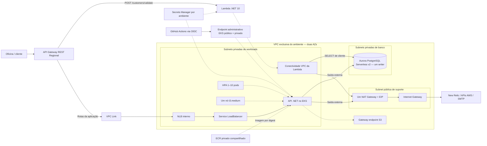
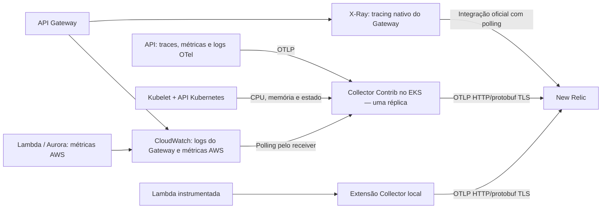

# Componentes e fronteiras

[Arquitetura](../README.md) · [RFC de execução](../rfcs/001-EXECUCAO.md) · [RFC de entrega](../rfcs/002-ENTREGA.md)

Arquitetura alvo. O conjunto abaixo existe separadamente em **hom** e **prd**, na mesma conta AWS e região us-east-1. A coexistência é suportada; ativar somente um ambiente é uma opção de economia.

O Service representa o recurso Kubernetes que solicita o NLB ao AWS Load Balancer Controller, não um segundo balanceador físico. O destino exato do NLB (nó/pod) e os protocolos serão fixados em E2/E3. A Lambda é um serviço gerenciado: o bloco de conectividade representa seu acesso à VPC, não uma execução dentro do EKS.

O Gateway é a entrada pública de negócio. O endpoint administrativo do EKS é outra superfície, autenticada por IAM e autorizada no cluster. NAT atende saída; Aurora não recebe rota de internet. O HPA escala pods dentro da capacidade disponível: o nó único não oferece alta disponibilidade nem escalonamento automático de nós.

S3 de estado, identidade OIDC, ECR e bucket separado de artefatos pertencem ao bootstrap compartilhado. VPC, EKS, Aurora, função, Gateway, NLB e segredos de cada ambiente são independentes. A destruição de hom não remove prd nem o bootstrap.

## Caminhos de observabilidade

Logs da aplicação/função têm um único caminho remoto via OTel; não duplicar sua ingestão por stdout/CloudWatch. O caminho CloudWatch do Gateway depende do Collector ativo. X-Ray possui atraso de polling e não alimenta alertas imediatos. A continuidade entre contextos W3C/AWS deve ser demonstrada, não presumida. Compatibilidade do receiver CloudWatch e da extensão Lambda será comprovada em E5.
