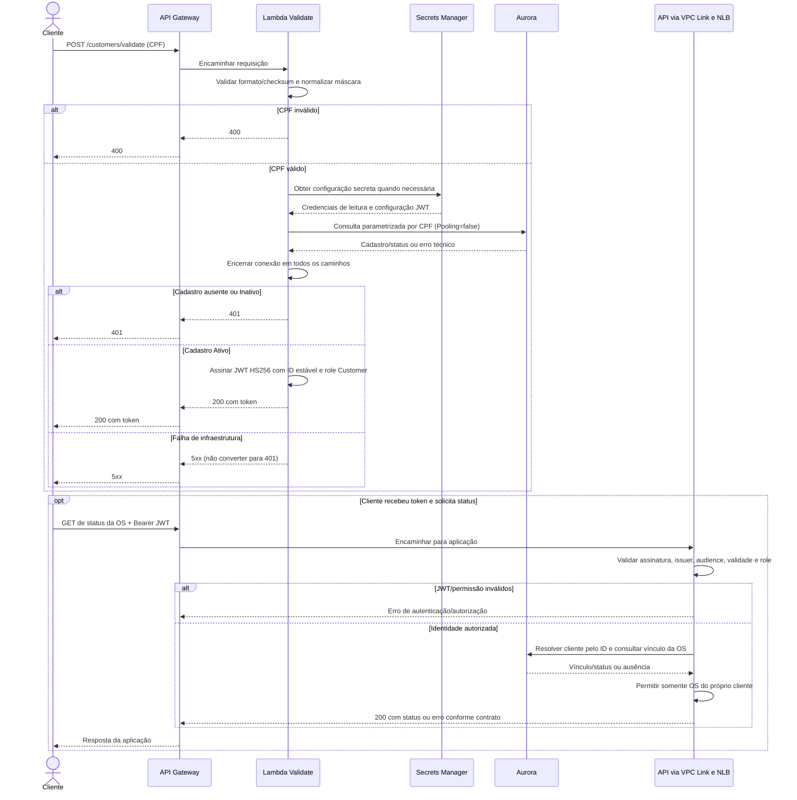

# Validação de CPF e acesso à própria OS

[Arquitetura](../README.md) · [Contrato completo](../ACESSO_E_AUTENTICACAO.md)

Fluxo alvo: validação cadastral sem senha; a função emite um token Customer. Isso não cria uma OS nem um usuário interno.

Falha ao obter secrets também é técnica e interrompe o fluxo com 5xx. Não registrar CPF, token ou valores de secrets. A elegibilidade Ativo é verificada na emissão: inativação/remoção posterior não revoga automaticamente uma sessão existente. A consulta ainda depende da existência dos recursos e do vínculo com a OS.

O JWT segue o contrato atual, com expiração emitida em UTC + 10 minutos e ID estável; cada ambiente tem sua configuração. API e função compartilharão as regras de CPF/JWT pelo pacote de contratos, sem dependência do domínio de OS. A autorização de aprovação/recusa segue a mesma verificação de propriedade e é exclusiva de Customer.
